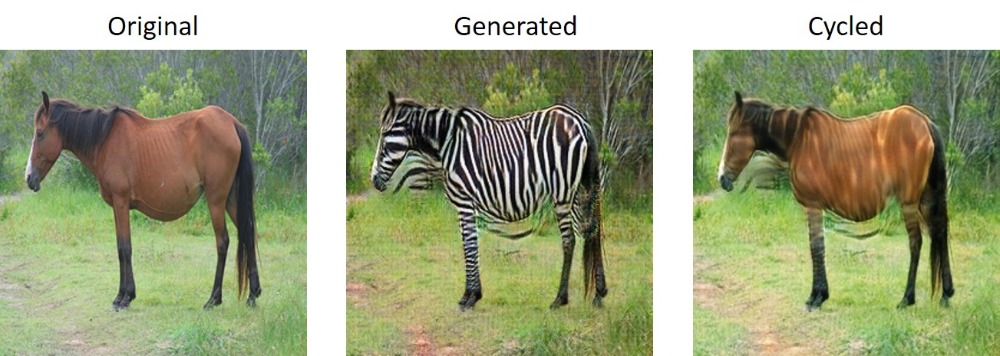

CycleGAN Notebook
=================

Practice implementing CycleGAN in Jupyter Notebook.

[Original paper](https://arxiv.org/pdf/1703.10593.pdf)

[Official implementation](https://github.com/junyanz/pytorch-CycleGAN-and-pix2pix)

The image below shows the result of tensorflow model trained about 200 epochs, I think it is worse than the result of the original author.


Below is the result of pytorch model, trained about 135 epochs on horse2zebra.



## Notebooks

[Tensorflow 2.0 Notebook](./tf_cycle_gan.ipynb)

[Pytorch Notebook](./pytorch_cycle_gan.ipynb)

### Some Minor Modification

* **Using random number within a range to replace label 0 and 1 while calculating the loss.**

    For example, using the random number between 0 to 0.3 while computing the loss of fake images, and 0.7 to 1.2 for real images.This idea is from [ganhacks](https://github.com/soumith/ganhacks). (Not sure whether it would be better for CycleGAN model or not)

## Environments

* Python 3
* jupyter
* numpy
* matplotlib
* tensorflow 2.0
* pytorch 1.2.0
* tqdm

## Get Started

### 1. Prepare Dataset

* #### Download the datasets in original author's paper.

    [Check here](https://github.com/junyanz/pytorch-CycleGAN-and-pix2pix/blob/master/docs/datasets.md).

    Take `monet2photo` for instance.

    **Linux**

    `
   mkdir -p datasets/monet2photo/
   wget https://people.eecs.berkeley.edu/~taesung_park/CycleGAN/datasets/monet2photo.zip -O ./datasets/monet2photo.zip
   unzip ./datasets/monet2photo.zip -d ./datasets/
   rm ./datasets/monet2photo.zip
    `

    **Windows**

    Download the dataset from the link https://people.eecs.berkeley.edu/~taesung_park/CycleGAN/datasets/monet2photo.zip, and unzip it in the `datasets` folder. The folder structure would be:
    ```
    .
    ├── ...
    ├── tf_cycle_gan.ipynb
    ├── datasets
    │   ├── monet2photo
    │         ├── testA
    │         ├── testB
    │         ├── trainA
    │         ├── trainB
    │
    └── ...
    ```
* #### Use own dataset(I have not try yet)

   It should be the same as the previous Windows part. First, you have to create a base folder in `datasets`, aldo have `testA, testB, trainA, trainB` folders in the base folder you just created. I think it is better to have close amout of images in `trainA` and `trainB`. Also as the original author says, 
>You should not expect our method to work on just any random combination of input and output datasets (e.g. cats<->keyboards). From our experiments, we >find it works better if two datasets share similar visual content. For example, landscape painting<->landscape photographs works much better than portrait >painting <-> landscape photographs. zebras<->horses achieves compelling results while cats<->dogs completely fails.

### 2. Download the pretrained checkpoints(Optional)

Download the pretrained checkpoints below, and unzip it in the `checkpoints` folder.

[Monet2Photo](https://drive.google.com/open?id=1Kyij9Drq6Iyc3SSF-InpyfzQrFDP54yO)

### 3. Modify the parameter in the notebook

Change the `DATASET` variable to the dataset name in the `Hyper Parameters & Setting` section.

### 4. Run the notebook

You can use the following command to check the status while training the model.

`
cd /to/path/of/this/project
tensorboard --logdir logs
`

About 400~600 seconds per epoch with a **NVIDIA 1080Ti GPU**.

## Known Issues

* **Fail message in console**: While training the models in tensorflow notebook, the console will appear this message `meta_optimizer.cc:502 layout failed: Invalid argument: Size of values 0 does not match size of permutation 4.`, I don't know where is the error occur, this error message also appear in the [Tensorflow Official CycleGAN Tutorial](https://www.tensorflow.org/tutorials/generative/cyclegan).

## Acknowledgements

Thanks to:

* [Official implementation](https://github.com/junyanz/pytorch-CycleGAN-and-pix2pix)
* [Tensorflow Official CycleGAN Tutorial](https://www.tensorflow.org/tutorials/generative/cyclegan)
* [Pytorch DCGAN Tutorial](https://pytorch.org/tutorials/beginner/dcgan_faces_tutorial.html)

I reference some part of implementation from them.
